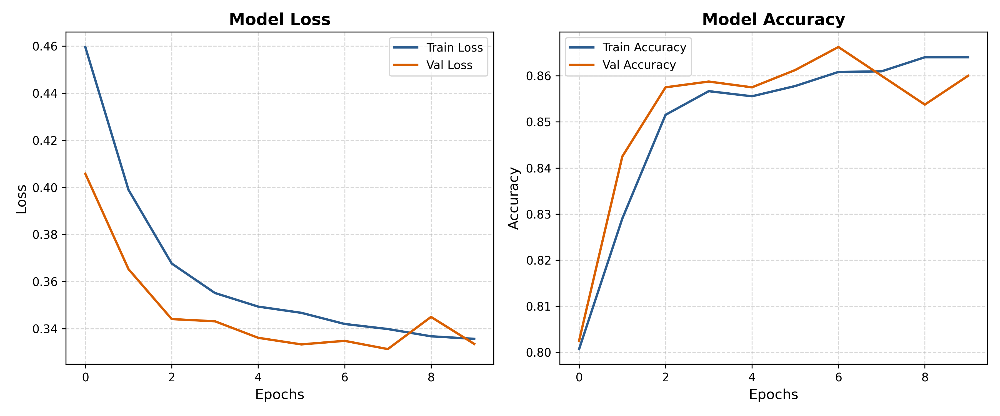
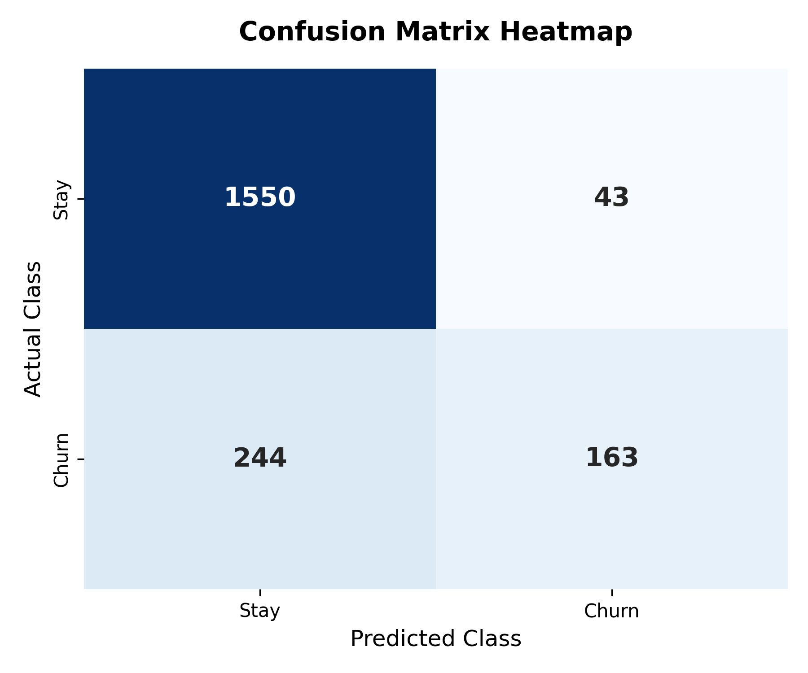

# Customer Churn Prediction using Artificial Neural Network (ANN)

[](https://www.python.org/)
[](https://tensorflow.org)
[](https://github.com/HThanh-how/customer-churn-prediction-ann/actions)
[](https://github.com/HThanh-how/customer-churn-prediction-ann/releases)

Dự án xây dựng mô hình mạng nơ-ron nhân tạo (ANN) truyền thẳng để dự đoán tỷ lệ khách hàng rời bỏ dịch vụ ngân hàng (Customer Churn) dựa trên bộ dữ liệu Churn Modelling từ Kaggle. Đây là nội dung thực hành Lab 4.1.

---

## 📄 Báo Cáo PDF Kết Quả (Lab Report)
Tải trực tiếp báo cáo học thuật đầy đủ được biên dịch tự động bằng LaTeX:

👉 [**Tải báo cáo Bao_cao_Lab_4.1.pdf**](https://github.com/HThanh-how/customer-churn-prediction-ann/releases/latest/download/Bao_cao_Lab_4.1.pdf)

---

## 📊 Kết Quả Thực Nghiệm Chính
Mô hình ANN đạt độ chính xác cao trên tập kiểm thử (2,000 khách hàng mới hoàn toàn):
* **Độ chính xác kiểm thử (Test Accuracy):** **85.65%**
* **Hàm mất mát (Test Loss):** **0.3549**

### Đồ thị Lịch sử Huấn luyện (Loss & Accuracy)


### Ma trận nhầm lẫn (Confusion Matrix Heatmap)


---

## 🛠 Kiến Trúc Mạng ANN Đề Xuất
* **Input Layer:** 11 node đặc trưng đầu vào (sau khi One-Hot Encoding và Scaling).
* **Hidden Layer 1:** Dense (11 units), hàm kích hoạt `ReLU`.
* **Hidden Layer 2:** Dense (128 units), hàm kích hoạt `ReLU`.
* **Output Layer:** Dense (1 unit), hàm kích hoạt `Sigmoid` đưa ra xác suất rời mạng.
* **Cấu hình Huấn luyện:**
  * Optimizer: `Adam`
  * Loss function: `Binary Cross-Entropy`
  * Epochs: 10
  * Batch Size: 10

---

## 🚀 Hướng Dẫn Cài Đặt và Chạy Notebook

1. **Clone repository:**
   ```bash
   git clone https://github.com/HThanh-how/customer-churn-prediction-ann.git
   cd customer-churn-prediction-ann
   ```

2. **Tạo môi trường ảo và cài đặt thư viện:**
   ```bash
   python3 -m venv .venv
   source .venv/bin/activate
   pip install -r requirements.txt
   ```

3. **Chạy Jupyter Notebook:**
   ```bash
   jupyter notebook churn_modelling.ipynb
   ```
